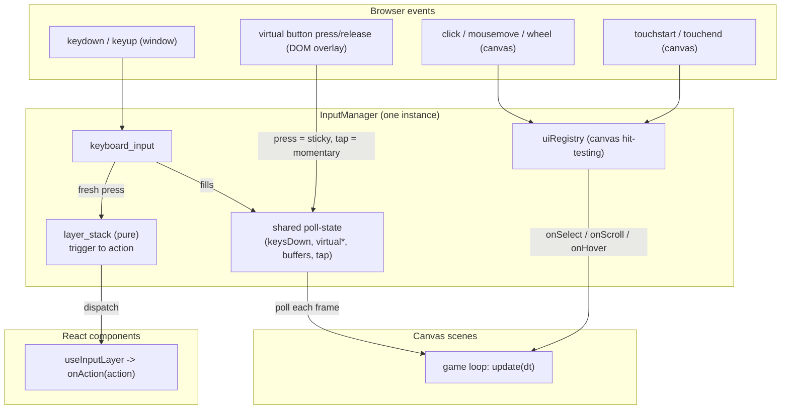
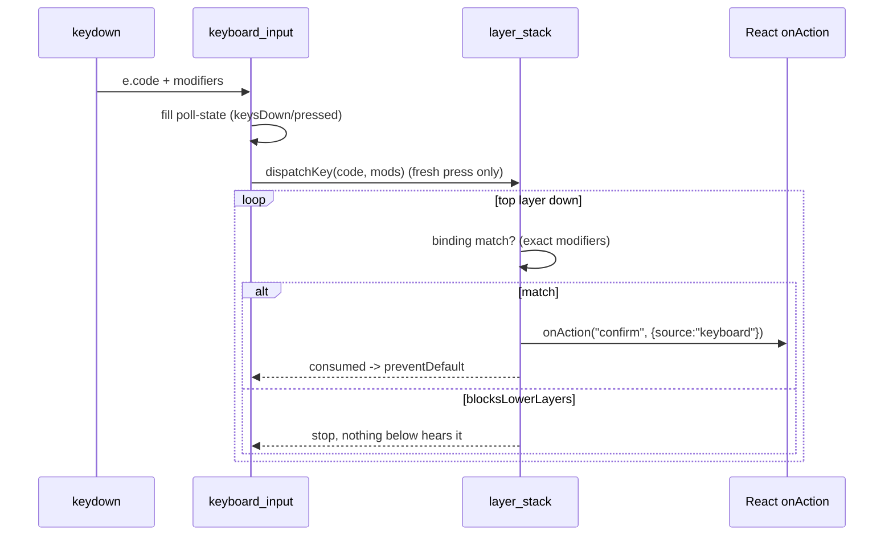

# Input System

A single input system for a **canvas game that also renders React overlays**. It
handles keyboard, mouse, touch, and on-screen touch buttons, and serves two very
different consumers from one keyboard source:

- **Canvas scenes** read input by _polling_ every frame (`isKeyDown`, `isTapped`, …).
- **React components** receive input as _events_ (semantic actions), via a hook.

The organizing idea, repeated everywhere, is one sentence:

> **Layers turn triggers into actions. Consumers only ever react to actions.**

A _trigger_ is a raw thing (a key + modifiers, a click, a tap). An _action_ is a
semantic string (`"confirm"`, `"close"`, `"toggle-locale"`). Nothing downstream
cares which key produced `"confirm"` — that mapping is the layer's job.

---

## Mental model: one system, two faces

There is exactly **one** input manager instance per game. It exposes two faces
that share the same keyboard handler and the same internal state:



Why two faces? A canvas game runs a `requestAnimationFrame` loop, so _polling_
("is this key down right now?") is natural. React components have no loop — they
need input _pushed_ to them as events. Rather than run two input systems, the
manager feeds **one** keyboard handler into both: it fills poll-state for the
canvas and dispatches actions to the React layer stack.

---

## Files

| File                                                        | Responsibility                                                                                      | Depends on                   |
| ----------------------------------------------------------- | --------------------------------------------------------------------------------------------------- | ---------------------------- |
| `types.ts`                                                  | Shared types: `InputLayer`, `KeyBinding`, `InputActionEvent`, `PointerHitTest`.                     | —                            |
| `layer_stack.ts`                                            | **Pure** layer stack. Maps a keypress to an action by walking layers top-down. No React/DOM/canvas. | `types`                      |
| `keyboard_input.ts`                                         | The single `window` keyboard listener. Fills poll-state; emits fresh presses.                       | —                            |
| `click_manager.ts`, `touch_manager.ts`, `scroll_manager.ts` | Pointer/touch/scroll → `uiRegistry` hit-testing.                                                    | `uiRegistry`                 |
| `uiRegistry.ts`                                             | Immediate-mode registry of clickable canvas regions (screen→logical coords, hover, double-click).   | —                            |
| `input_manager.ts`                                          | Composes everything into one instance. Poll face + `push` face + `getInput()` accessor.             | all of the above             |
| `virtual_controls.ts`                                       | Scene-driven on-screen touch buttons (DOM overlay).                                                 | `input_manager`              |
| `useInputLayer.ts` (React)                                  | Thin hook: builds a layer from props and pushes it.                                                 | `input_manager` (via barrel) |

Read them in this order to learn the system: `layer_stack.ts` → `input_manager.ts`
→ `useInputLayer.ts` → `virtual_controls.ts`.

---

## How input flows

### Keyboard

`keyboard_input` uses `e.code` (physical key position, layout-independent) for
game controls and `e.key` for text/number buffers. On every **fresh** press it
also calls the manager's dispatch, which asks `layer_stack` to resolve the key
against the top-most React layer that binds it:



Bindings match on **exact modifiers**: `{ code: 'KeyL' }` fires on plain L, not
Ctrl+L; `{ code: 'KeyS', ctrl: true }` fires only on Ctrl+S.

### Pointer & touch (canvas)

Clicks, taps, wheel, and swipes are hit-tested against `uiRegistry` regions,
which scenes register **inside `render()`** (immediate mode). A tap reuses the
click path, and a swipe reuses the scroll path, so a region's `onSelect`/`onScroll`
responds to both mouse and touch. Hover/cursor is mouse-only (touch has no hover).

### Pointer & touch (React)

React handles its own click/touch through normal `onClick` handlers. The input
system does **not** route pointer to React — only keyboard. (`hitTest` exists on a
layer for canvas use, where the browser can't hit-test inside a `<canvas>`.)

### Virtual touch buttons

`virtual_controls` renders an on-screen d-pad / action buttons as a DOM overlay.
Holding a button calls `pressVirtualKey` (**sticky** — stays down until release),
so a held d-pad produces continuous movement. Menu/region clicks use
`tapVirtualKey` (**momentary** — auto-released next frame).

---

## Lifecycle

- **Per frame** (canvas game loop): `uiRegistry.clear()` → `scene.update(dt)` →
  `scene.render(ctx)` re-registers regions → `input.endFrame()` clears
  pressed/tap/momentary state (but **not** held keys or sticky virtual keys).
- **Per scene transition**: `setOnTransition` fires `endFrame()` (so the key that
  triggered the transition doesn't bleed into the new scene) and applies that
  scene's virtual-control layout.
- **Per React scene**: `useInputLayer` pushes a layer on mount, pops it on unmount
  or when `active` becomes false — automatic, nothing to tear down.
- **Per game**: one `createInputManager` instance; `setActiveInput` on start,
  `setActiveInput(null)` + `input.destroy()` on teardown.

---

## Using it

### From a canvas scene (poll)

```ts
update(dt: number) {
  if (input.isKeyDown('ArrowUp')) movePlayer('up');
  if (input.isKeyPressed('Enter')) confirm();   // once per press
}

render(ctx) {
  uiRegistry.registerRegion({
    id: 'confirm',
    x, y, width, height,
    onSelect: () => input.tapVirtualKey('Enter'),  // momentary, not press
  }).render((cfg) => drawButton(ctx, cfg));
}
```

### Declaring a scene's touch buttons

```ts
// no field           -> full default overlay (dpad + ab + utility + numbers)
virtualControls: ['dpad', 'ab'],                       // movement + confirm only
virtualControls: ['numbers', { id: 'v-run', label: 'RUN', key: 'KeyR' }], // + custom
virtualControls: [],                                   // no buttons (e.g. React scene)
```

Omitting a preset removes it; listing a custom button adds it. The overlay is a
pure function of the active scene — it can't drift.

### From a React component (events)

```tsx
useInputLayer({
  id: 'party-screen',
  name: 'Party Screen',
  blocksLowerLayers: false,
  keyBindings: [
    { code: 'Escape', action: 'close' },
    { code: 'KeyL', action: 'toggle-locale' },
  ],
  onAction: (action) => {
    if (action === 'close') onClose();
    else if (action === 'toggle-locale') toggleLocale();
  },
});
```

Toggle `active` from existing state (`active: screen === 'party'`); never call the
hook conditionally.

---

## Install / wire into a new game

1. **Copy the `input/` folder** (`types`, `layer_stack`, `keyboard_input`,
   `click_manager`, `touch_manager`, `scroll_manager`, `uiRegistry`,
   `input_manager`, `virtual_controls`, and the touch overlay CSS) plus the React
   `useInputLayer.ts`.

2. **Provide two config constants** the registry needs for screen→logical
   coordinate mapping (adjust to your resolution):

   ```ts
   export const LOGICAL_WIDTH = 240;
   export const LOGICAL_HEIGHT = 160;
   ```

3. **Barrel** (`input/index.ts`):

   ```ts
   export { createInputManager, getInput, setActiveInput, type InputManager } from './input_manager';
   export type { InputLayer, KeyBinding, InputActionEvent, PointerHitTest } from './types';
   ```

4. **Wire it in `createGame`:**

   ```ts
   const input = createInputManager(canvas);
   setActiveInput(input); // lets React reach it
   const virtualControls = createVirtualControls(input, container);

   stateMachine.setOnTransition(() => {
     input.endFrame();
     virtualControls.applyLayout(stateMachine.current()?.virtualControls);
   });

   // game loop:
   uiRegistry.clear();
   stateMachine.update(dt);
   stateMachine.render(ctx);
   input.endFrame();

   // destroy:
   virtualControls.destroy();
   setActiveInput(null);
   input.destroy();
   ```

5. **Point the hook's import** at your barrel (`getInput` and the types).

The only game-specific coupling is `LOGICAL_WIDTH/HEIGHT`, the preset button
labels/keys in `virtual_controls.ts`, and the CSS module. Everything else is
game-agnostic.

---

## Caveats (read before extending)

- **Held vs one-shot virtual keys.** `pressVirtualKey` is sticky (needs a matching
  `releaseVirtualKey`); `tapVirtualKey` is momentary. Region `onSelect` must use
  `tapVirtualKey`, or the key sticks down forever (no "up" event from a click).
- **`keyBindings` are not reactive.** The hook's effect deps are `[id, active]`, so
  changing bindings at runtime won't update a live layer. If you need that, give
  the layer a new `id`. This is deliberate (avoids re-pushing on every render).
- **`hitTest` is dead for React layers.** Use `onClick`. It only matters if you
  push a _canvas_ layer through the stack later.
- **Global keys during React text entry.** The `window` keydown handler still runs
  (and `preventDefault`s arrows/Enter/Space) while a React scene is open. If you
  add React text inputs, guard against this (e.g. skip dispatch when a form field
  is focused).
- **Immediate-mode registry contract.** Regions must be re-registered in `render()`
  every frame; `uiRegistry.clear()` must run once per frame in the loop.

---

## Design assessment (honest)

**Overall: strong, ~A-.** The parts I'd defend as genuinely good practice, and the
parts that are pragmatic compromises forced by the hybrid canvas+React setup:

**Best-practice, would build the same way again**

- `layer_stack.ts` is pure and dependency-free — the real logic is isolated and
  trivially testable. This is the strongest part.
- Trigger→action separation keeps consumers decoupled from key codes.
- Sticky/momentary virtual-key split is the correct, minimal fix for held controls.
- Scene-declared controls with _replace + presets_ make the overlay derived state
  (can't drift), and mirror the React `keyBindings` shape.
- The hook is thin and idiomatic (ref for `onAction`, `active` flag instead of
  conditional hooks).

**Forced / compromise (works, but not what you'd pick with a free hand)**

- **The `getInput()` module singleton.** A global with a runtime "not initialized"
  guard is a mild smell. The clean React answer is a Context provider — but the game
  mounts React _imperatively_ (`createRoot` per scene), so Context would need extra
  plumbing for little gain. Given that constraint, the singleton is the reasonable
  call. Score this piece a B.
- **Two paradigms coexisting** (poll for canvas, push for React). One unified
  event model would be tidier in the abstract, but the canvas loop genuinely wants
  polling. The duality is inherent to canvas+React, not a mistake — but it is extra
  surface area to learn.
- **`uiRegistry` is a separate module-level singleton** from the input manager.
  Pre-existing, harmless, but it means there are two "global-ish" objects rather
  than one owner.
- **Keyboard handler double-duty** (fills poll-state _and_ dispatches to layers,
  with `preventDefault` interplay) couples two concerns in one place. Acceptable,
  but the one spot where responsibilities blur.

If you later want to push toward "textbook": replace the singleton with a Context
provider, make bindings reactive, and guard dispatch when a DOM input is focused.
None are urgent; all are incremental.
